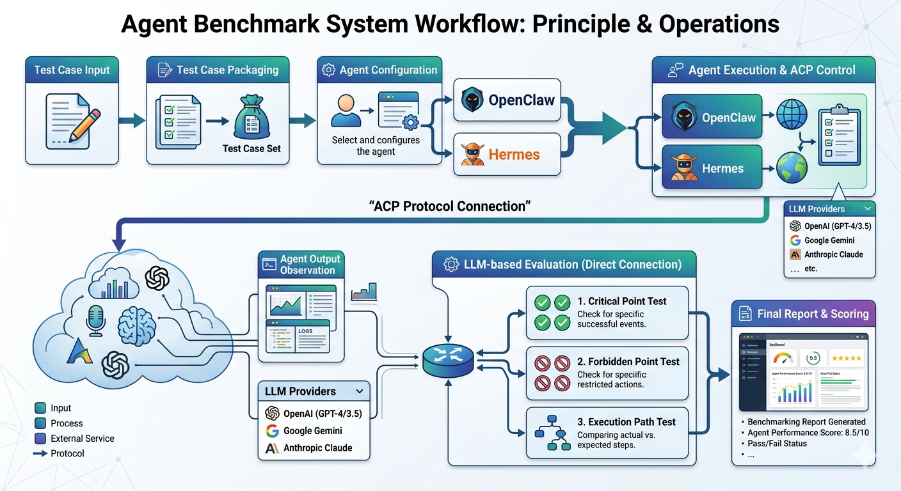

# Benchmark Runner



AI Agent Benchmark Platform for executing, evaluating, and managing AI Agent test cases.

## Features

1. **Benchmark Dashboard** - View test case input, expected output, actual output, key test points, forbidden points, and scores
2. **Test Set Management** - Manage test cases with support for syncing from Lark/Feishu Bitable
3. **Agent Management** - Configure Agent names and ACPX parameters
4. **Evaluator Management** - Configure evaluators with variable reference support for context
5. **Benchmark Execution** - Launch test execution with support for variable injection and format requirements

## Golden Dataset

A **golden dataset** entry is not only a question–answer pair. Each item is defined by:

| Element | Role |
|--------|------|
| **Question** | The user-facing task or instruction the agent must solve |
| **Expected answer** | The reference outcome (what “right” looks like at the output level) |
| **Key points** | Non-negotiable criteria that must be met for the solution to count as correct |
| **Prohibited behaviors** | Patterns, shortcuts, or outputs that must **not** occur |
| **How to implement** | The intended approach: ordering of steps, APIs or tools to use, and other constraints on *how* the problem should be solved |

**What we grade on.** Evaluations in this project treat the following as the primary signals:

1. **Key points** — Are all required criteria satisfied?
2. **Prohibited behaviors** — Does the run stay clear of every forbidden pattern?
3. **Implementation path** — Does the agent follow the prescribed way to implement the solution, not only land on a plausible final answer?

Surface-level agreement with the expected answer is insufficient if key points are missed, forbidden behavior appears, or the prescribed path is ignored.

## Testing Philosophy

For each benchmark item, we aim for **a single canonical path** from problem statement to correct solution—the one that reflects the intended reasoning, tool use, and constraints. If several unrelated approaches could all produce a similar-looking answer, the case should be tightened until **only one path** is fully defensible.

Under this philosophy, **even when the final answer matches the reference, scores stay low if the agent took a different valid-looking route** or skipped steps that the golden path encodes. Correctness is judged on **process fidelity and constraint adherence**, not on output alone.

## Tech Stack

- **Frontend**: Next.js 16 + React 19 + TypeScript + Tailwind CSS 4 + shadcn/ui
- **Backend**: Next.js API Routes + SQLite (better-sqlite3)
- **Execution Engine**: Python 3.12+ with ACPX protocol

## Quick Start

### 1. Install Dependencies

```bash
cd benchmark-runner
npm install
```

### 2. Configure Environment

Ensure the following are installed on your system:
- Node.js 18+
- Python 3.12+
- ACPX CLI (for executing Agents)

Create `.env.local` file and configure environment variables:

```bash
# Database path (optional, defaults to data/benchmark.db)
DATABASE_PATH=data/benchmark.db
```

### 3. Run Development Server

```bash
npm run dev
```

Visit http://localhost:3000

## Usage Workflow

1. **Create Agent** - Add Agent name and ACPX configuration in the Agent management page
2. **Create Test Cases** - Add test cases in the Test Set management page
3. **Create Evaluator** - Configure evaluation rules in the Evaluator management page (optional)
4. **Create Benchmark** - Select Agents, test cases, and evaluator in the Benchmark execution page
5. **Execute Benchmark** - Click the execute button to start testing
6. **View Results** - View detailed results and scores on the Benchmark dashboard

## Lark Bitable Sync

The Test Set management page supports syncing test case data from Feishu/Lark Bitable.

### Supported Field Mappings

| Field | Description | Required |
|-------|-------------|----------|
| test_id / ID | Unique identifier for the test case | ✅ |
| input / question / query | User input/question content | ✅ |
| name / case_name | Test case name | ❌ |
| description / case_description | Test case description | ❌ |
| expected_output / expected_answer | Expected response content | ❌ |
| key_points / test_points | Key test points (supports multi-line/comma-separated) | ❌ |
| forbidden_points / forbidden_content | Content that should not appear (supports multi-line/comma-separated) | ❌ |
| category / type / classification | Test case category | ❌ |

### Sync Modes

- **Update or Create (default)**: Update if exists, create if not
- **Create Only**: Only import new test cases, skip existing ones
- **Update Only**: Only update existing test cases, do not create new records

## License

MIT
